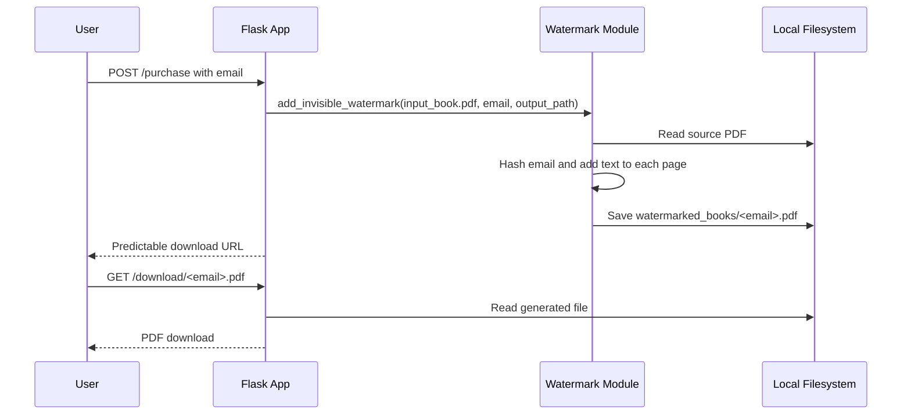
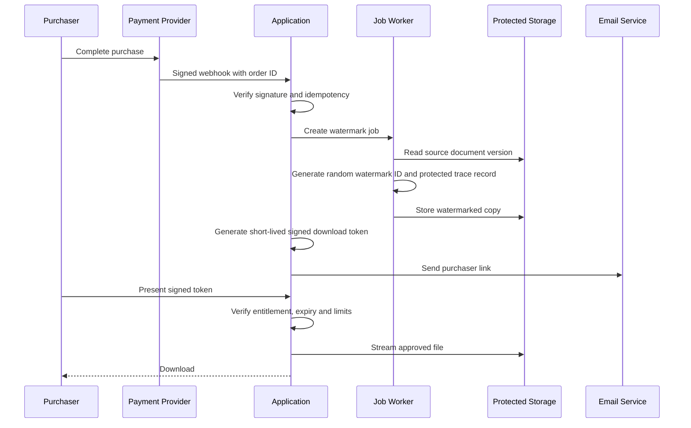

# Automated PDF Watermarking System

> **Document version:** R1.00  
> **Documentation status:** Reviewed from repository evidence  
> **Last code review:** 2026-07-14  
> **Repository:** https://github.com/Wattysaid/InvisiblePdfWatermark  
> **Default branch:** `main`  
> **Commit reviewed:** `4b110baea28854db605db9fbbe523b9492178689`  
> **Maintainer:** Wattysaid

Automated PDF Watermarking System is a Python and Flask proof of concept that derives a purchaser-specific identifier from an email address, embeds the identifier as very small white text in a PDF and returns a download URL. The watermarking function and Flask routes are implemented, but the current purchase and download flow is not secure enough for deployment because it lacks payment verification, authentication, signed links, safe filenames, data-retention controls and production server configuration.

## Documentation Scope and Verification

| Item | Value |
|---|---|
| Repository reviewed | `https://github.com/Wattysaid/InvisiblePdfWatermark` |
| Branch | `main` |
| Commit | `4b110baea28854db605db9fbbe523b9492178689` |
| Review date | `2026-07-14` |
| Reviewer | `GPT-5.6 Thinking` |
| Review method | Static inspection of `watermark.py`, `app.py` and the existing README |
| Commands executed | None; PDFs were not generated and the Flask server was not started |
| Excluded areas | Watermark detectability, PDF compatibility, reverse-proxy deployment, payment provider and email delivery |
| Confidence | High for the reviewed source; low for security and operational readiness |

### Documentation Status Legend

| Status | Meaning |
|---|---|
| **Verified** | Confirmed through source inspection and successful validation or tests |
| **Implemented, not executed** | Code exists but was not run during this review |
| **Partial** | Some implementation exists, but material controls are absent |
| **Planned** | Described without implementation evidence |
| **Unknown** | Evidence is insufficient or contradictory |

## Contents

- [Product and Domain Overview](#product-and-domain-overview)
- [Architecture and Workflow](#architecture-and-workflow)
- [Repository Structure](#repository-structure)
- [Watermark Algorithm](#watermark-algorithm)
- [HTTP Interface](#http-interface)
- [Identity, Keys and Duplicate Prevention](#identity-keys-and-duplicate-prevention)
- [File Storage and Lifecycle](#file-storage-and-lifecycle)
- [Security and Privacy](#security-and-privacy)
- [Testing and Quality Assurance](#testing-and-quality-assurance)
- [Getting Started](#getting-started)
- [Known Limitations and Risks](#known-limitations-and-risks)
- [Safe Change Guidance for Autonomous Agents](#safe-change-guidance-for-autonomous-agents)
- [Release and Versioning](#release-and-versioning)
- [Changelog](#changelog)
- [Licence](#licence)

## Product and Domain Overview

### Users and Actors

| Actor | Objective | Main Capabilities | Access Boundary |
|---|---|---|---|
| Purchaser | Obtain an individually marked PDF | Submit an email and receive a download URL | Public Flask endpoints in current prototype |
| Content seller | Trace redistributed copies to a purchaser record | Generate and retain a purchaser-specific identifier | Application and order system |
| Payment provider | Confirm that a purchase is valid | Not implemented | Required external trust boundary |
| Flask application | Create output PDFs and serve downloads | Local process and filesystem |
| PyMuPDF | Read, modify and save PDF content | Local library |
| Email service | Deliver secure links | Not implemented |

### Core Domain Concepts

| Concept | Definition | Source of Truth | Identifier |
|---|---|---|---|
| Purchaser | Person receiving a document | Current request email; no customer database | Email address |
| Purchase | Verified commercial transaction | Not implemented | Required order or payment ID |
| Document | Source PDF being sold | Fixed `input_book.pdf` path | Required document ID or version |
| Watermark identifier | Value embedded into the PDF | SHA-256 of raw email in current code | 64-character hexadecimal hash |
| Watermarked copy | Generated purchaser-specific PDF | Local `watermarked_books/` directory | Current filename is raw email |
| Download entitlement | Right to retrieve one generated copy | Not implemented | Required signed token or entitlement ID |

### Capability Status

| Capability | Status | Evidence |
|---|---|---|
| Generate SHA-256 identifier from email | Implemented, not executed | `generate_hash(email)` |
| Apply text to every PDF page | Implemented, not executed | `add_invisible_watermark()` |
| Generate a purchaser-specific file | Implemented, not executed | Output path includes email |
| Purchase endpoint | Partial | Accepts any posted email; no purchase verification |
| Download endpoint | Partial and insecure | Public email-address path; no authentication or expiry |
| Secure download link | Planned | README describes it, but code returns a predictable URL |
| Payment handling | Planned | No payment integration found |
| Email delivery | Planned | Comment only |
| Retention and deletion | Not implemented | No lifecycle logic found |

## Architecture and Workflow

### Current Prototype



### Required Production Flow



The production flow is a required design, not an implemented feature.

## Repository Structure

```text
InvisiblePdfWatermark/
├── watermark.py       # Email hashing and PDF text insertion
├── app.py             # Prototype Flask purchase and download routes
├── requirements.txt   # Expected dependency manifest, not independently inspected
└── readme.md
```

## Watermark Algorithm

### Current Implementation

```python
def generate_hash(email):
    return hashlib.sha256(email.encode()).hexdigest()
```

For each PDF page, the code inserts:

```text
Unique ID: <sha256(email)>
```

using font size `0.1` and white text.

### Algorithm Limitations

- SHA-256 is deterministic, so the same email always produces the same identifier.
- Email addresses have a relatively small and guessable input space; a hash is pseudonymisation, not anonymisation.
- A known email can be hashed and matched to the embedded value.
- The watermark is embedded as text and may be discoverable through text extraction, PDF inspection or colour manipulation.
- Very small white text is not guaranteed to be visually or technically invisible across viewers, printers, PDF transformations or accessibility tools.
- Watermarks may be removed by rasterisation, redaction, page reconstruction or content sanitisation.
- The code creates a `TextWriter` but does not use it to write content; `insert_textbox` performs the actual insertion.
- Example code executes immediately when `watermark.py` is imported, which can create files unintentionally.

### Recommended Identifier Design

Use a random, non-guessable watermark ID associated with an order record:

```text
watermark_id = cryptographically random UUID or token
trace record = watermark_id -> order_id, document_version, created_at
```

Do not embed the email or a direct deterministic hash of it. Store the mapping in a protected database with restricted access and retention controls.

## HTTP Interface

### Current Endpoints

| Access | Method | Endpoint | Purpose | Authentication | Validation | Side Effects | Status |
|---|---|---|---|---|---|---|---|
| Public | POST | `/purchase` | Generate a watermarked copy | None | Direct `request.form['email']` only | Creates a file | Partial and insecure |
| Public | GET | `/download/<email>.pdf` | Download a generated copy | None | Path parameter only | Reads and sends a file | Partial and insecure |

### Required Request Controls

- Verify a payment-provider webhook rather than trusting a public purchase form.
- Validate and normalise email only when it is genuinely required.
- Use an order ID and random watermark ID as canonical references.
- Use signed, expiring, single-use or rate-limited download tokens.
- Prevent path traversal and filesystem metacharacters.
- Apply rate limiting and abuse detection.
- Do not expose customer identifiers in URLs.
- Return generic errors that do not reveal file existence.

## Identity, Keys and Duplicate Prevention

| Object | Current Identifier | Problem | Required Rule |
|---|---|---|---|
| Purchaser | Raw email | Personal data and mutable natural key | Internal customer ID with normalised email stored separately |
| Watermark | SHA-256 of email | Guessable and reused across orders | Random immutable watermark ID per order and document version |
| Output file | Raw email filename | Personal data, unsafe characters and collision risk | Random storage key unrelated to customer data |
| Purchase | None | Cannot prove entitlement or prevent duplicate processing | Unique payment-provider event and order ID |
| Download | Email URL | Predictable and unlimited | Signed token with expiry, usage count and order scope |

### Duplicate-Prevention Register

| Event or Object | Uniqueness Rule | Enforcement Needed | Recovery |
|---|---|---|---|
| Payment webhook | Provider event ID | Unique database constraint | Return success for previously processed event |
| Purchase | Provider order or payment ID | Unique constraint | Reconcile duplicate notifications |
| Watermarked artefact | Order ID plus document version | Unique constraint | Reuse existing successful output or regenerate safely |
| Download token | Random token hash | Unique constraint | Revoke and issue a replacement |

## File Storage and Lifecycle

### Current Storage

| Store | Path | Access Control | Retention | Deletion |
|---|---|---|---|---|
| Source PDF | `input_book.pdf` | Process filesystem | Undefined | Manual |
| Generated PDFs | `watermarked_books/<email>.pdf` | Process filesystem and public route | Undefined | None implemented |

### Required Storage Controls

- Store source and generated PDFs outside the public web root.
- Use object storage or a protected filesystem with least-privilege access.
- Encrypt stored files where appropriate.
- Use random object keys.
- Record document version and checksums.
- Define retention and deletion schedules.
- Delete abandoned or failed outputs.
- Avoid generating files synchronously in a public request for large documents.
- Validate source and output PDFs before delivery.

## Security and Privacy

| Control Area | Current State | Risk | Required Improvement |
|---|---|---|---|
| Payment verification | Not implemented | Anyone can generate copies | Verified signed webhooks and order state |
| Download authorisation | None | Anyone knowing an email can download | Signed expiring entitlement tokens |
| Filename safety | Raw email used in path | Path manipulation and personal-data exposure | Random storage key and strict validation |
| Debug mode | `debug=True` | Information disclosure and remote-code risk in unsafe deployment | Disable debug; use production WSGI server |
| Personal data | Email used in hash, path and URL | Privacy and traceability risk | Minimise email use and store protected mapping |
| Watermark confidentiality | Deterministic email hash | Dictionary matching | Random watermark ID |
| Input validation | None beyond form lookup | Invalid input and server errors | Schema validation and length limits |
| Rate limiting | None | Resource exhaustion | Per-IP and per-account controls |
| File access | `send_file` by predictable path | File disclosure | Entitlement checks and protected storage |
| Logging | Not defined | Sensitive data could be logged | Structured redacted logs |
| Terms and notice | Mentioned in README | Consent and transparency incomplete | Clear purchaser notice and privacy policy |

### Threat Cases

| Threat | Asset | Current Mitigation | Residual Risk |
|---|---|---|---|
| Unauthorised PDF generation | Licensed content | None | Critical |
| Guessing another user's download URL | Generated PDF | None | Critical |
| Path traversal through email input | Filesystem | Flask route constraints only; purchase path remains unsafe | High |
| Brute-force generation | CPU, storage and content | None | High |
| Email-hash re-identification | Purchaser privacy | SHA-256 only | High |
| Watermark removal | Traceability | Small white text | High |
| Debug information disclosure | Application and filesystem | None when debug enabled | Critical in deployment |

## Testing and Quality Assurance

No automated tests or CI workflow were verified.

| Test Layer | Required Coverage | Reviewed Result | Gap |
|---|---|---|---|
| Unit | Hash normalisation and watermark insertion | Not run | Behaviour unverified |
| PDF compatibility | Multi-page, encrypted, malformed and rotated PDFs | Not run | File failures unknown |
| Import safety | Import `watermark.py` without side effects | Expected to generate example output | Module design defect |
| Endpoint validation | Missing, invalid and malicious email input | Not run | Validation absent |
| Authorisation | Expired, reused and cross-order tokens | Not implemented | Critical gap |
| Path security | Traversal characters and long input | Not run | Critical gap |
| Concurrency | Simultaneous requests for the same purchaser | Not run | Collision and corruption risk |
| Performance | Large PDFs and many pages | Not run | Request timeout and memory risk |
| Watermark recovery | Extract ID from delivered file | Not implemented or tested | Trace workflow incomplete |

## Getting Started

### Prerequisites

- Python 3.7 or later, as documented by the original repository.
- Flask.
- PyMuPDF, imported as `fitz`.

### Installation

```bash
git clone https://github.com/Wattysaid/InvisiblePdfWatermark.git
cd InvisiblePdfWatermark
python -m venv .venv

# Windows
.venv\Scripts\activate

# macOS or Linux
source .venv/bin/activate

pip install -r requirements.txt
```

### Local Proof-of-Concept Execution

```bash
python app.py
```

The current application starts Flask in debug mode and exposes insecure routes. Use only non-sensitive test files on an isolated local environment. Do not expose it to a network or deploy it as written.

### Safer Watermark Function Usage

Before importing `watermark.py`, move its example execution into:

```python
if __name__ == "__main__":
    add_invisible_watermark("input_book.pdf", "buyer@example.com", "watermarked_book.pdf")
```

Use synthetic test email addresses and disposable PDFs.

## Known Limitations and Risks

| ID | Area | Finding | Impact | Priority | Recommended Action |
|---|---|---|---|---|---|
| DOC-RISK-001 | Access control | Download endpoint is public and predictable | Unauthorised access to purchased content | P0 | Implement signed expiring entitlement tokens |
| DOC-RISK-002 | Purchase validation | `/purchase` accepts any submitted email | Free generation and resource abuse | P0 | Trigger generation only from verified payment events |
| DOC-RISK-003 | Path safety | Raw email is embedded in filesystem paths and URLs | Path manipulation, collisions and personal-data leakage | P0 | Use random storage IDs and strict validation |
| DOC-RISK-004 | Debug server | Application runs with `debug=True` | Severe production security risk | P0 | Disable debug and use a production WSGI server |
| DOC-RISK-005 | Privacy | Deterministic email hash is embedded in every page | Purchaser may be re-identified; data minimisation is weak | P0 | Use a random watermark ID mapped to an order |
| DOC-RISK-006 | Watermark robustness | Small white text is removable and technically discoverable | Weak deterrence and trace reliability | P1 | Define the threat model and test layered watermark techniques |
| DOC-RISK-007 | Import side effects | Example code runs when `watermark.py` is imported | Unexpected file generation and failures | P1 | Add a main guard |
| DOC-RISK-008 | Concurrency | Output filename is based only on email | Multiple purchases overwrite one another | P0 | Key artefacts by order and document version |
| DOC-RISK-009 | Retention | Generated files are retained indefinitely | Privacy and storage exposure | P1 | Add lifecycle and deletion jobs |
| DOC-RISK-010 | Errors | Missing files, invalid PDFs and failed writes are not handled | Server errors and partial outputs | P1 | Add typed errors, cleanup and user-safe responses |
| DOC-RISK-011 | Licence | No licence was verified | Reuse rights unclear | P2 | Add an intentional licence or private-use declaration |

## Safe Change Guidance for Autonomous Agents

- Do not present the current Flask routes as secure commerce or delivery functionality.
- Preserve the existing watermarking intent while replacing email-derived IDs with random order-scoped IDs.
- Never use customer emails in filenames or public URLs.
- Do not add payment handling without webhook verification, idempotency and reconciliation.
- Store files outside the public web root and enforce entitlement before every download.
- Disable Flask debug mode in all shared or deployed environments.
- Add a main guard before importing `watermark.py` elsewhere.
- Preserve placeholders until the production provider and storage design are approved.
- Update this README whenever identifiers, routes, storage or privacy behaviour changes.

## Release and Versioning

| Item | Approach | Source of Truth |
|---|---|---|
| Application version | Commit-based | Git history |
| Document version | Source PDF checksum and approved product version | Future document catalogue |
| Watermark version | Algorithm and embedded payload version | Future watermark metadata |
| API version | Not currently versioned | Flask routes |
| Documentation version | `R1.00` | `readme.md` |

## Changelog

| Documentation Version | Date | Commit Reviewed | Author | Summary |
|---|---|---|---|---|
| R1.00 | 2026-07-14 | `4b110baea28854db605db9fbbe523b9492178689` | GPT-5.6 Thinking | Reorganised the existing documentation and recorded the current prototype architecture, privacy model and critical purchase, path, download and debug-mode risks |

## Licence

No licence file was verified during this review. Unless a licence exists elsewhere in the repository, reuse rights are not granted by default.
